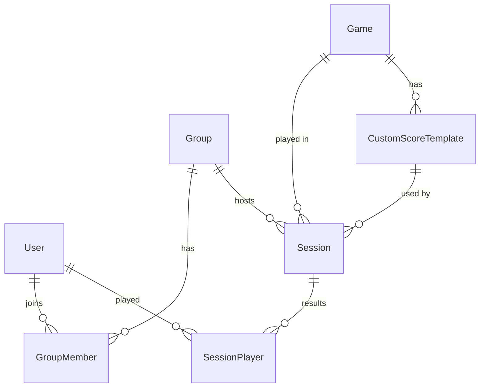

# Technical Documentation

## Architecture Overview

This project is built with **Next.js 15** using the **App Router**.
-   **Frontend**: React, Tailwind CSS, Shadcn/UI, Recharts.
-   **Backend**: Next.js API Routes (`app/api/*`).
-   **Database**: SQLite via Prisma ORM.

---

## 🗄️ Database Schema

The data model centers around **Sessions** played by **Users** within **Groups**.

### Core Models

1.  **User**: A global player entity.
    -   `id`, `name`, `email`
2.  **Group**: A collection of users who play together.
    -   `id`, `name`, `members`
3.  **Game**: A board game title.
    -   `id`, `name`, `templates`
4.  **Session**: A single instance of a game played.
    -   `playedAt`, `gameId`, `groupId`
5.  **SessionPlayer**: A player's performance in a session.
    -   `rawScore`, `placement`, `pointsAwarded` (League Points)

### Diagram (Textual)



---

## 🔌 API Reference

### Games
-   `GET /api/games`: List all games.
-   `POST /api/games`: Create a new game.
-   `GET /api/games/[id]/templates`: List scoring templates for a game.

### Groups
-   `GET /api/groups`: List all groups.
-   `POST /api/groups`: Create a new group.
-   `GET /api/groups/[id]`: Get group details.
-   `POST /api/groups/[id]/members`: Add a user to a group.
-   `DELETE /api/groups/[id]/members`: Remove a user from a group.

### Users
-   `GET /api/users`: List all users.
-   `POST /api/users`: Create a new user.

### Statistics
-   `GET /api/statistics/[userId]`: Fetch aggregated stats for a user.
    -   **Returns**: `totalGames`, `summary` (wins/2nd/3rd/last), `pieData`, `gamesData`.

---

## 🛠️ Development & Maintenance

### Accessing the Database
The database is a local file at `prisma/dev.db`.

**Using Prisma Studio (Recommended)**:
A web-based GUI to view and edit data.
```bash
npx prisma studio
```

**Using CLI**:
```bash
sqlite3 prisma/dev.db
```

### Modifying the Schema
1.  Edit `prisma/schema.prisma`.
2.  Create a migration:
    ```bash
    npx prisma migrate dev --name description_of_change
    ```

### Seed Data
Populate the database with initial test data:
```bash
npx prisma db seed
```
(Ensure `prisma/seed.ts` is configured in `package.json`).

